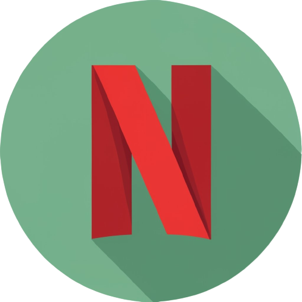

<table style="border: 1px solid #ccc; border-collapse: collapse;">
  <tr>
    <td style="padding: 10px;"></td>
    <td style="padding: 10px;">Netflix GPT</td>
  </tr>
</table>

NetflixGPT is a cool Web Streaming app, ChatGPT enabled.

## Tasks/Progress of Completion

- Create React App
- Configured TailwindCSS
- Header
- Routing of App
- Login Form
- Sign up Form
- Form Validation
- useRef Hook
- Firebase Setup
- Deploying our app to production
- Create SignUp User Account
- Implement Sign In user Api
- Created Redux Store with userSlice
- Implemented Sign out
- Update Profile
- BugFix: Sign up user displayName and profile picture update
- BugFix: if the user is not logged in Redirect /browse to Login Page and vice-versa
- Unsubscibed to the onAuthStateChanged callback
- Add hardcoded values to the constants file
- Regiter TMDB API & create an app & get access token
- Get Data from TMDB now playing movies list API
- Custom Hook for Now Playing Movies
- Create movieSlice
- Update Store with movies Data
- Planning for MainContauiner & secondary container
- Fetch Data for Trailer Video
- Update Store with Trailer Video Data
- Embedded the Yotube video and make it autoplay and mute
- Tailwind Classes to make Main Container look awesome

## Features

- Login/Sign Up
  - Sign In /Sign up Form
  - redirect to Browse Page
- Browse (after authentication)
  - Header
  - Main Movie
    - Tailer in Background
    - Title & Description
    - MovieSuggestions
      - MovieLists \* N
- NetflixGPT
  - Search Bar
  - Movie Suggestions
    17.3 x 9.741 rem movie card

Home, TV Shows, Movies, New & Popular,
